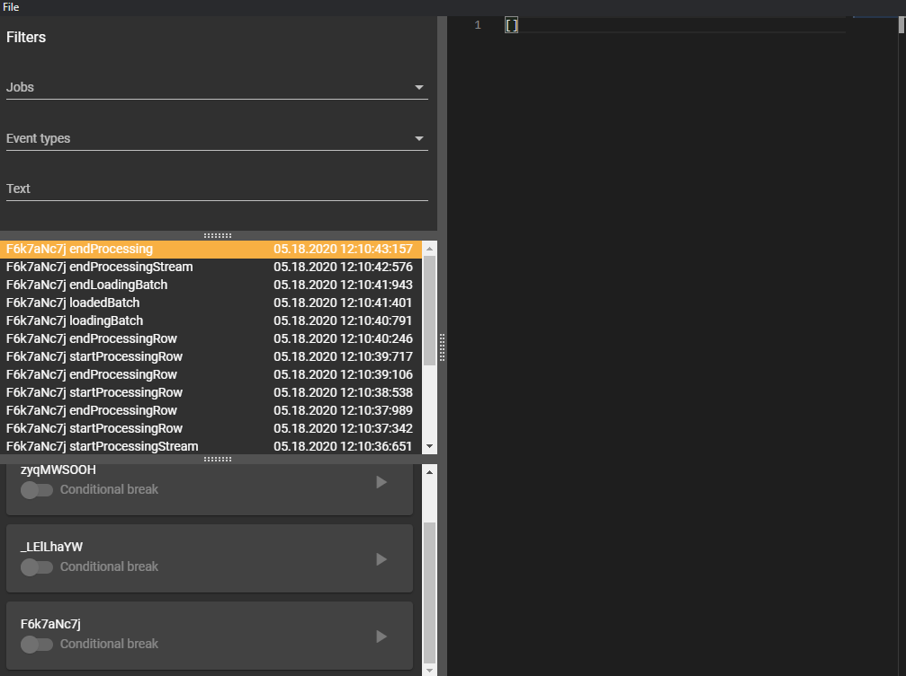

# bellboy-event-viewer

* If used together with [bellboy-live-reporter](https://github.com/Claviz/bellboy-live-reporter) allows executing [bellboy](https://github.com/Claviz/bellboy) jobs step-by-step.
* Supports light/dark theme.
* Supports job filtering by event contents.

## Compatible with
* [bellboy-live-reporter](https://github.com/Claviz/bellboy-live-reporter) (>= v.0.1.0)
* [bellboy-log-reporter](https://github.com/Claviz/bellboy-log-reporter) (>= v.0.0.1)

## Favicon

Icons made by <a href="https://roundicons.com/" title="Roundicons">Roundicons</a> from <a href="https://www.flaticon.com/" title="Flaticon">www.flaticon.com</a>
